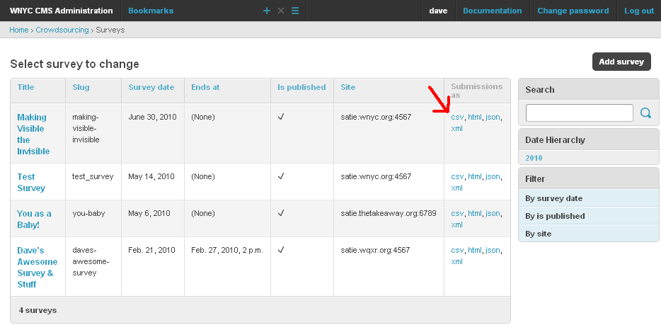

.. _downloading-survey-submissions:

******************************
Downloading Survey Submissions
******************************

In the survey list in the Django admin you can click to download a csv, json, xml, or html file of all the submissions for that survey. This feature is part of a more powerful :ref:`API` for the more technically minded. If you are a logged in staff member, as you must be to see the Django admin, the :ref:`API` will return all submissions and all answers to questions, regardless of whether they are public.

