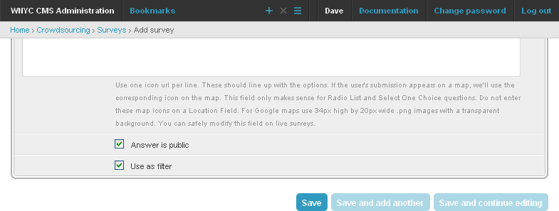

**********
Categories
**********

Let's say you want to create a survey where everybody identifies as a liberal or a conservative. Now let's say you want to make a report for the liberals, a report for the conservatives, and a combined report. You might start by setting up this survey. First notice the all important radio button list question which lets the user pick whether they are a liberal or a conservative. Next notice that this same question sets up some map icons. When crowdsourcing displays the map for the location question it will use our custom icons depending on how users answer this question.

Let's set up a survey report. Pay particular attention to the Survey Report Displays. We've set our report to display a map, followed by a bar chart, followed by some arbitrary text. The map is simple enough. It will display an icon for every submission with a valid address. The map, by default, will set the zoom and location so that it can display all icons at once. The bar chart here will show how many conservatives there are and how many liberals there are. Finally, the arbitrary text will display links to the same report but with filters in place. Notice that you can insert arbitrary html in the report. Also pay attention to the links we insert into the survey. We make clever use of the filters to display only liberals, only conservatives, or both.

.. image:: images/LiberalConservativeReport.png
