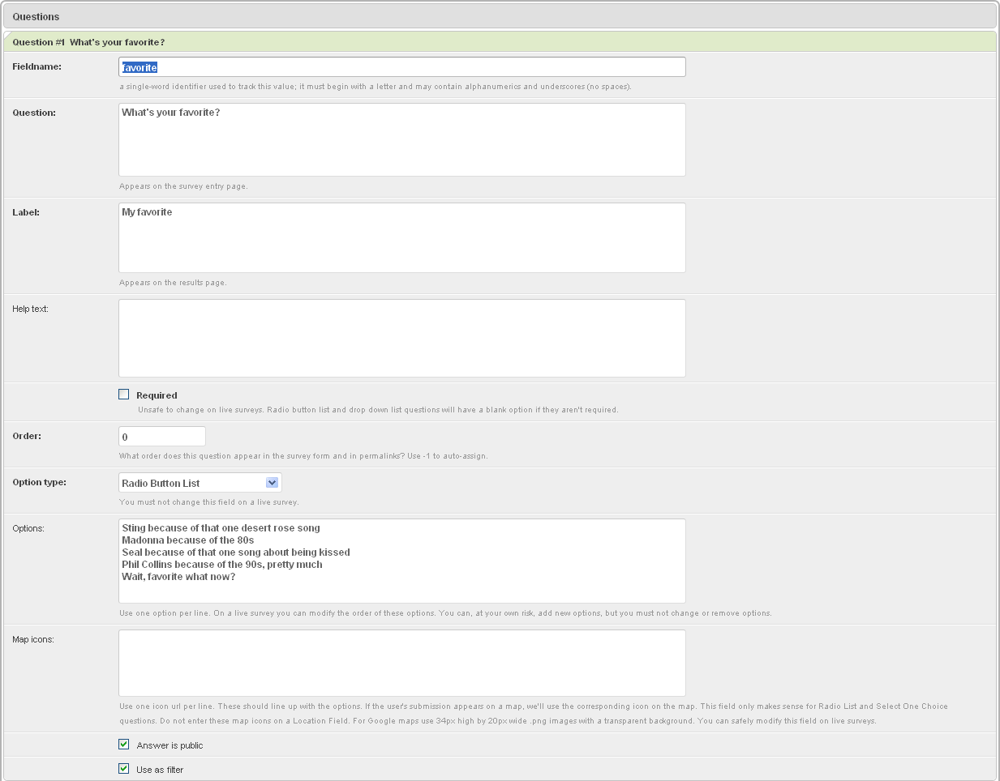

*********************
A Bar Chart of Counts
*********************

If you have a multiple choice question with many answers, or with long answers, then a pie chart may not work very well.

Try using a bar chart where each bar represents the number of times that option was selected. 

