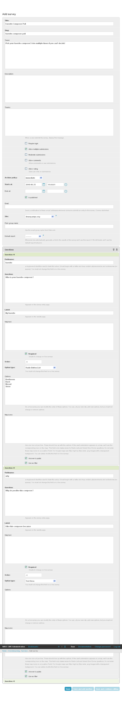
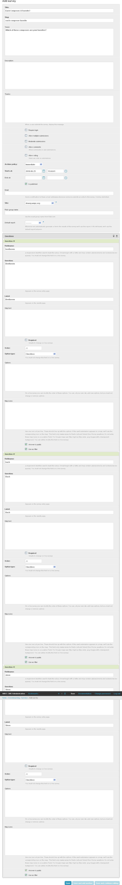
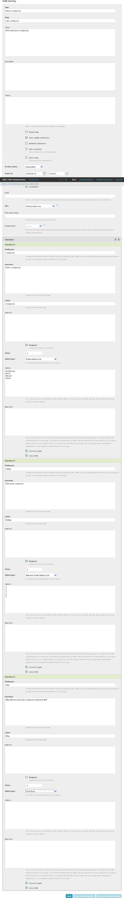
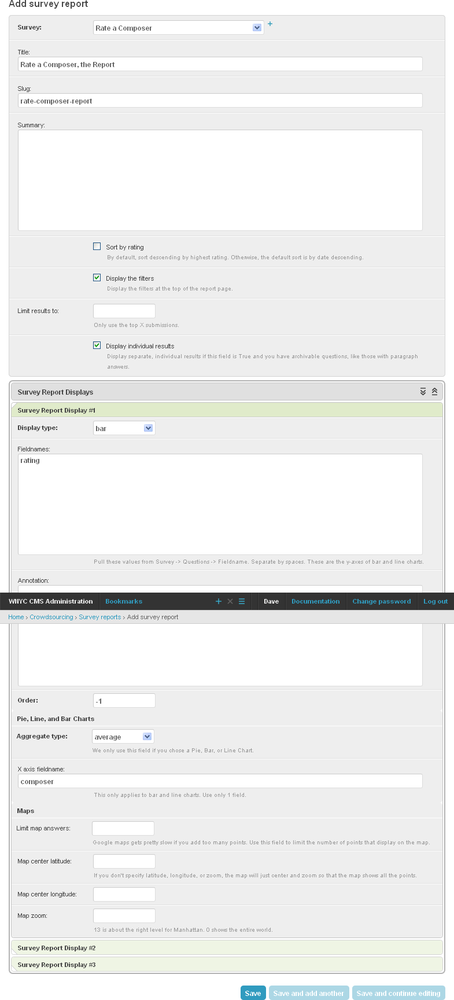

*****************
Favorite Composer
*****************

Let's say you have a couple of composers that you want to get some feedback on. Here are several different approaches you could take.

Simple Poll
===========

Let's simply allow users to pick their favorite composer from a list. In other words, you could set this up as a simple poll with a pie chart display that breaks down the results. We will have a single question where the user may pick a composer. We'll set it up so users can enter multiple times which will allow them to stuff the ballot box for a particular composer or vote on multiple composers.

Yes or No For Each Composer
===========================

For this approach, we'll let each user enter the survey only once. Every composer gets a separate check box. We'll use the default survey report to display a pie chart for every composer showing checks vs. empty checks.

Rate a Composer
===============

In this approach we will let each user pick a single composer and rate him or her. Then we'll display a bar chart that shows the average rating that each composer receives. Again we'll let each user vote multiple times.

